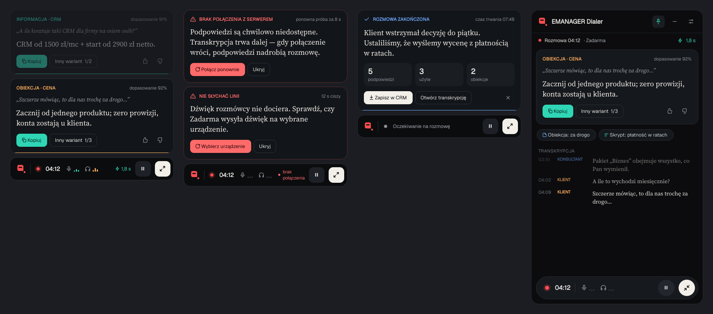

# EMANAGER Dialer: копайлот для оператора

Оверлей поверх всех окон Windows показывает оператору Zadarma короткие подсказки во время звонка.
Всё работает в одном `EmanagerDialer.exe` на ПК оператора, отдельный сервер не нужен: распознавание
речи NVIDIA Parakeet на процессоре (без видеокарты), поиск по базе знаний в Supabase pgvector
(по желанию) и Gemini с мастер-промптом EMANAGER.PRO.

```
EmanagerDialer.exe на ПК оператора                                              [Облако]
 микрофон ─► L ┐                     VAD по каналам (Silero ONNX)
               ├─ 16 кГц stereo ─►   Parakeet TDT 0.6B v3 (pl, CPU) ─► [Klient]/[Operator]
 loopback ─► R ┘ (только звук        RAG: e5-small ─────────────────────────► Supabase pgvector
                  Zadarma)           Gemini (JSON) ─────────────────────────► Gemini API
 PyQt6 оверлей ◄── JSON-подсказка ◄──┘
```

Внутри exe распознавание и Gemini — это тот же код, что лежит в `backend/` (FastAPI). Exe запускает его
в фоновом потоке на `127.0.0.1` со случайным портом и подключается к нему по WebSocket, так что это
деталь реализации и настраивать её не нужно.



## Структура

| Путь | Что внутри |
|---|---|
| `client/` | Приложение Windows: оверлей, захват аудио, встроенный бэкенд |
| `client/dialer_client/local_server.py` | Запускает код из `backend/` внутри приложения |
| `client/dialer_client/settings_dialog.py` | Окно с ключом Gemini (первый запуск и меню) |
| `client/dialer_client/zadarma_audio.py` | Аудиосессии Zadarma в Windows: начало и конец звонка |
| `client/dialer_client/overlay.py`, `widgets.py`, `theme.py` | UI по макету: панель 400×56, виджеты подсказок, ошибок, итога звонка, развёрнутая панель 420×720 |
| `client/dialer_client/audio.py` | Захват: L = микрофон, R = WASAPI loopback (PyAudioWPatch), ресемплинг в 16 кГц (soxr) |
| `client/dialer_client/net.py` | WebSocket с автопереподключением и буфером на 60 с (подсказки «догоняют» разговор) |
| `client/dialer_client/crm.py`, `login_dialog.py` | Вход оператора в CRM и поиск клиента по номеру и по названию для карточки |
| `backend/sql/crm_dialer_current_call.sql` | Необязательная функция в базе CRM: номер текущего звонка из событий Zadarma |
| `client/dialer_client/detect.py` | Определение начала и конца звонка по звуку, проверка процесса Zadarma |
| `backend/app/main.py` | FastAPI, WebSocket `/ws` (внутренний протокол exe), описание в начале файла |
| `backend/app/stt.py` | VAD-нарезка по каналам (Silero ONNX) + Parakeet через onnx-asr на CPU (int8), батчинг запросов всех операторов |
| `backend/app/langfilter.py` | Отбрасывает английские фразы, которые Parakeet v3 иногда выдаёт на тихом звуке |
| `backend/models/silero_vad.onnx` | Модель Silero VAD (MIT), взята из recorder_fork |
| `backend/app/session.py` | RAG-контроллер: фильтр реплик, поиск, вызов Gemini, дедупликация, обогащение JSON для UI |
| `backend/app/llm.py` | Gemini: мастер-промпт делится на статичную `system_instruction` и динамический блок |
| `backend/app/rag_store.py` | Эмбеддинги e5 (`query:`/`passage:`), поиск через asyncpg, логирование звонков |
| `backend/sql/001_schema.sql` | Схема Supabase: `kb_items` (vector 384, HNSW), `match_kb()`, `calls`, `call_utterances`, `call_hints` |
| `backend/kb/` | База знаний: `*.jsonl` (Q&A, возражения, скрипты) и `regulations/*.md` (регламенты) |
| `backend/tools/` | `ingest_kb` (загрузка базы), `extract_qa` (пары Q&A из удачных звонков), `simulate_call` (тест без софтфона) |
| `prompts/master_prompt_pl.md` | Мастер-промпт EMANAGER.PRO (польский) |

## Запуск

1. Скачайте [EmanagerDialer.exe](https://github.com/999who/dialer/releases/download/client-latest/EmanagerDialer.exe)
   (собирается автоматически из `main`), положите в любую папку и запустите.
2. Сначала войдите в CRM своим логином и паролем. Затем в окне «Gemini API KEY» вставьте ключ с [aistudio.google.com/apikey](https://aistudio.google.com/apikey)
   (поле «Supabase URI» можно оставить пустым) и нажмите «Sprawdź i zapisz». Только после этого открывается оверлей. Ключ и модель сохраняются в `config.toml` рядом с exe, поменять их потом
   можно через логотип на панели → «Ustawienia (klucz Gemini)».
3. При первом запуске exe скачает модель распознавания Parakeet (~670 МБ) в кэш Hugging Face, пока на
   оверлее висит карточка «Przygotowanie rozpoznawania mowy». Следующие запуски занимают 10–20 с.

Оверлей виден в панели задач и в трее. Лог: `%LOCALAPPDATA%\EMANAGER\EMANAGER Dialer\dialer.log`
(логотип → «Pokaż dziennik»). Если Windows SmartScreen предупредит о неизвестном издателе, нажмите
«Подробнее» → «Выполнить в любом случае»: exe не подписан сертификатом.
Если Zadarma выводит звук не в устройство по умолчанию (например, в гарнитуру), выберите его через
логотип на панели → «Dźwięk rozmówcy» или укажите `line_device` в `config.toml`.

### База знаний (по желанию)
Без базы Gemini подсказывает только по мастер-промпту. Чтобы подключить базу:
1. Supabase → SQL Editor → вставить `backend/sql/001_schema.sql` → Run.
2. Загрузить `backend/kb/` в базу (нужен Python 3.11+):
   ```bat
   cd backend
   python -m venv .venv && .venv\Scripts\activate
   pip install torch --index-url https://download.pytorch.org/whl/cpu
   pip install -r requirements.txt
   set DATABASE_URL=postgresql://...   :: Project Settings → Database, Session pooler, порт 5432
   python -m tools.ingest_kb
   ```
3. Ту же строку подключения вписать в `config.toml` рядом с exe: `database_url = "postgresql://..."`.

### Карточка клиента из CRM
Во время звонка над панелью висит карточка: кто звонит, остаток часов абонемента, открытые
тикеты, последний разговор и что тогда обещали, сделка. Тот же блок получает Gemini.
1. Оператор входит в дайлер своим аккаунтом CRM (окно при запуске, или логотип → «Konto CRM»).
   Звонки записываются на того, кто вошёл, а данные читаются с его правами в CRM.
   Адрес CRM и публичный (publishable) ключ вшиты в приложение (`client/dialer_client/config.py`):
   они не секретные, доступ решают вход оператора и RLS в CRM. Секретный / service_role ключ
   и строку подключения к Postgres сюда класть нельзя: репозиторий и exe публичные, а секретный
   ключ дайлер и так отказывается принимать.
2. Чтобы карточка появлялась с первой секунды, администратор один раз выполняет в SQL Editor
   проекта CRM файл `backend/sql/crm_dialer_current_call.sql`: функция только на чтение, отдаёт
   номер текущего звонка из событий Zadarma. Без неё карточка появится, когда клиент представится.
3. `crm_sip` в `config.toml`: внутренний номер Zadarma этого ПК, если операторы работают на разных.
   `own_numbers`: номера самой фирмы, по ним карточка не показывается.

Кого показывать по номеру: сначала клиента CRM (контакт клиента, телефон клиента, сделка с
клиентом), затем сделку без клиента, затем контакт из Google. Если номер у двух клиентов
(один владелец, две фирмы), показываются обе. Тестовые клиенты (`is_demo` или «test» в названии)
пропускаются. Дайлер в CRM ничего не пишет.

### Разработка
```bat
cd client
python -m venv .venv && .venv\Scripts\activate
pip install -r requirements.txt
python run.py            :: приложение со встроенным бэкендом из ..\backend
python run.py --demo     :: только UI, без звука и Gemini
python run.py --selftest :: проверка встроенного бэкенда без UI
pip install pyinstaller && pyinstaller EmanagerDialer.spec   :: -> dist\EmanagerDialer.exe
```
Тест без звонка: `python -m tools.simulate_call` из `backend/` против бэкенда, запущенного через
`uvicorn app.main:app` (см. начало `backend/app/main.py`).

## Решения, которые стоит знать

- **Модель Gemini.** Gemini 1.5 Flash отключена. По умолчанию стоит `gemini-3.8-flash`
  (стабильная, сентябрь 2026) с `thinking_level=low`. Если задержка выше 2,5 с, переключите
  `GEMINI_MODEL=gemini-3.5-flash-lite`. Обе меняются в `.env` без правки кода.
- **Parakeet на процессоре, как в recorder_fork.** Parakeet TDT 0.6B v3 (25 европейских языков,
  включая польский) запускается через `onnx-asr` на onnxruntime, только CPU, квантизация int8.
  Silero VAD тоже работает из ONNX-файла, поэтому бэкенду не нужны ни видеокарта, ни NeMo.
  Перед распознаванием звук проходит фильтр 80 Гц и нормализацию, а после — фильтр английских
  фраз (v3 нельзя жёстко переключить на польский). Модель не потоковая: реплика распознаётся
  целиком, как только VAD видит 450 мс тишины. Время распознавания растёт с длиной реплики;
  `parakeet_threads` в `config.toml` (2–4) задаёт, сколько ядер отдать модели.
- **Роли без диаризации.** Спикер определяется каналом: L всегда оператор, R всегда клиент.
- **Захват.** WASAPI loopback ничего не отдаёт, пока в динамиках тишина, а у двух звуковых карт
  разные часы. Микшер работает по 100-мс тактам от системных часов, дополняет пустой канал нулями и
  отбрасывает отставание больше 300 мс, так что каналы не разъезжаются.
- **Звук не покидает ПК.** Аудио идёт только внутри exe (через `127.0.0.1`). Наружу уходит лишь текст
  реплик в Gemini и, если подключена база, в Supabase.
- **Начало и конец звонка.** Локального API у Zadarma нет, поэтому клиент смотрит на аудиосессии
  Windows (`client/dialer_client/zadarma_audio.py`, библиотека pycaw): открыт ли у Zadarma микрофон и
  насколько громко звучит именно Zadarma, без YouTube, Teams и системных звуков. Звонок начинается,
  когда у Zadarma открыт микрофон и из неё ≥0,6 с слышен голос (рингтон без микрофона не считается).
  Заканчивается, когда Zadarma закрывает свои аудиопотоки на 2 с, или после 15 с тишины. Пока Zadarma
  молчит, правый канал глушится, так что чужие звуки не распознаются как голос клиента. Если они
  звучат одновременно с Zadarma, они всё же попадут в запись: чтобы исключить и это, выведите Zadarma в
  гарнитуру, а остальное в динамики, и укажите гарнитуру в `line_device`. `call_detect = "voice"`
  возвращает старый режим (по любому звуку). Последние 3 с до старта досылаются, первые слова не
  теряются. Есть ручной старт и стоп в меню. Точные границы дадут вебхуки АТС Zadarma
  (`NOTIFY_START`/`NOTIFY_END`), их можно подключить к бэкенду следующим шагом.
- **Проверка Gemini.** Окно настроек проверяет ключ одним коротким запросом. При старте встроенный бэкенд
  проверяет его ещё раз. Если ключ или модель не подходят, в логе будет `GEMINI CHECK FAILED` с
  причиной, а на оверлее появится карточка «Podpowiedzi niedostępne».
- **Приватность.** Вне звонка и на паузе аудио с ПК не уходит.
- **Мастер-промпт.** Статичная часть (до `---`) уходит в `system_instruction`, блок с
  `{rag_context}`, `{last_hint}`, `{transcript_history}` уходит в `contents`. Для модели это тот же
  текст, но одинаковый префикс включает неявное кэширование Gemini. Подстановка идёт через
  `str.replace`, потому что в промпте есть фигурные скобки JSON.
- **Обогащение подсказки.** Gemini возвращает только `show/category/hint`. Бэкенд сам добавляет
  цитату клиента, «dopasowanie NN%» (сходство лучшего совпадения), чипы источников и
  «Inny wariant» (готовые `hint` из равнозначных совпадений базы).
- **Защита от повторов.** Одновременно идёт один запрос к Gemini на звонок. Новые реплики во время
  запроса схлопываются до последней, а одинаковая подсказка второй раз не показывается.

## Что проверено, а что нет

Проверено в облачной Linux-среде: 25 юнит-тестов, включая настоящий Silero VAD на onnxruntime (бэкенд и клиент), сквозной прогон
клиент ↔ WebSocket ↔ бэкенд с подставной LLM, схема SQL и загрузка/поиск/логирование на Postgres 16 +
pgvector, сборка запроса к Gemini (google-genai 2.28), отрисовка всех экранов оверлея (картинка выше).

Не проверено, нужен ваш Windows-ПК: реальный захват WASAPI (PyAudioWPatch есть только
под Windows), распознавание Parakeet и его скорость на вашем процессоре, загрузка моделей Parakeet и e5
(Hugging Face закрыт в моей среде),
живые вызовы Gemini и фактическая задержка, расход памяти клиентом на Windows (на Linux демо-режим
занимает ~53 МБ).
